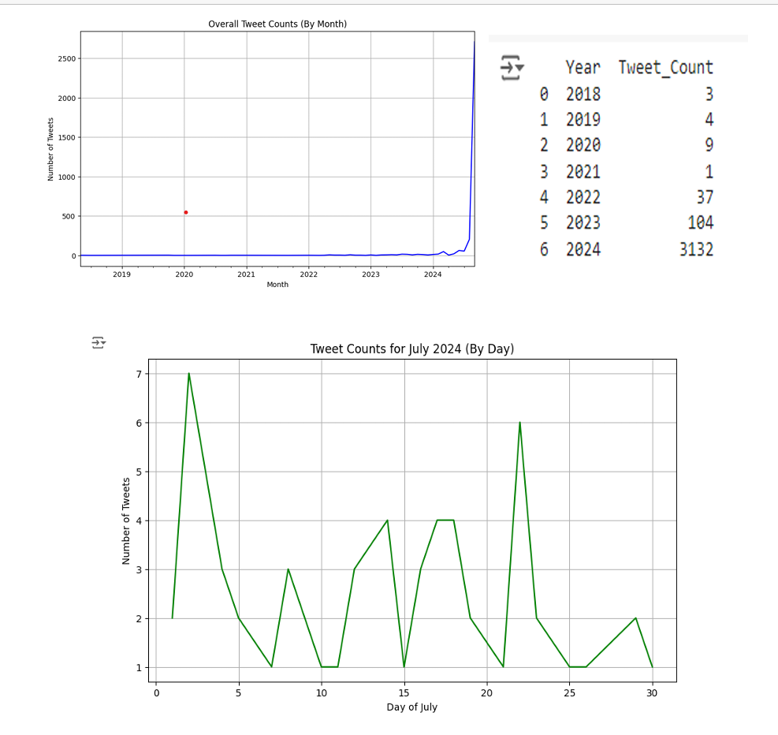
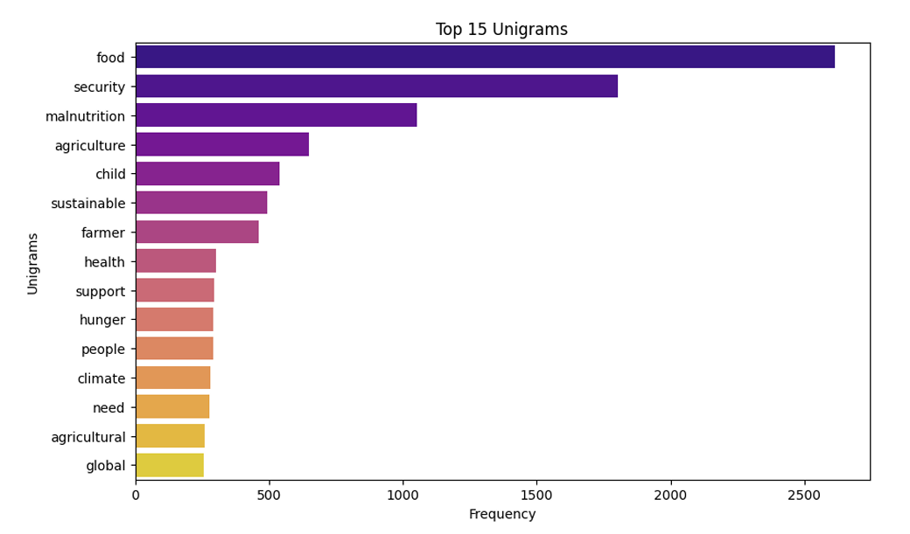
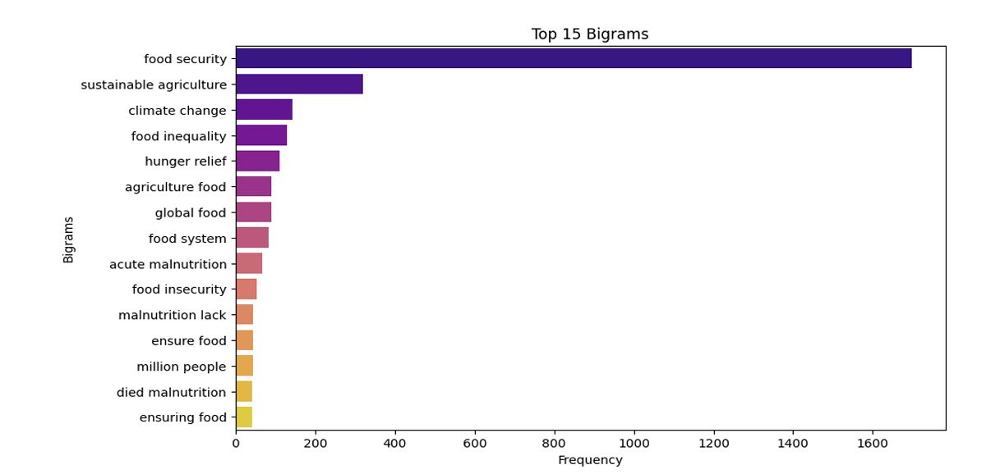
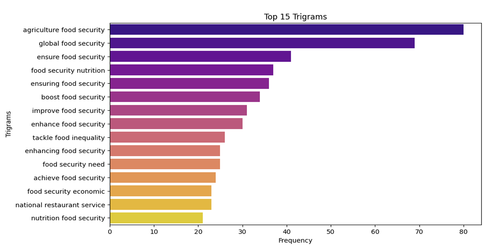
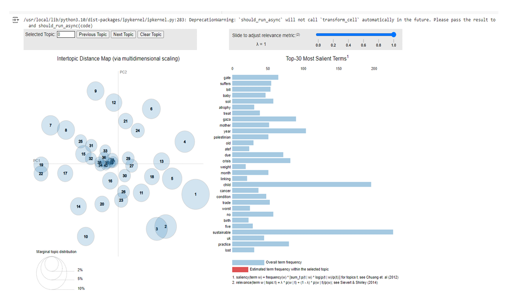
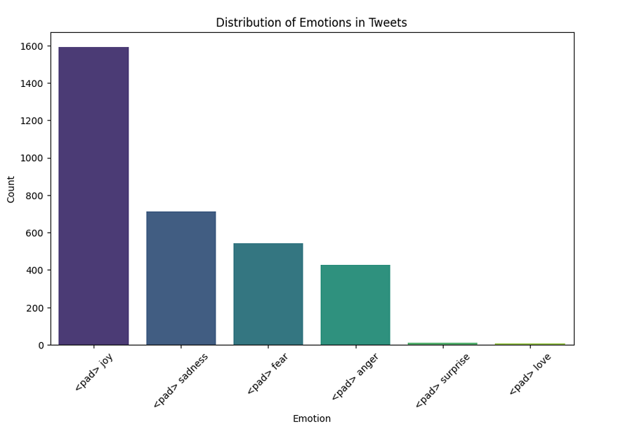

# Zero Hunger — Twitter Discussion Analytics (SDG 2)

A text-mining/NLP analysis of Twitter discussions around **UN Sustainable Development Goal 2: Zero Hunger**, focused on uncovering the **main themes**, **sentiment shifts over time**, and **dominant emotions** in public conversation.

## Project outputs
- 📓 Notebook: `21883191_BUS5PR1_Assignment2.ipynb`
- 📄 Report: `21883191_BUS5PR1_Assignmnt2_Report.pdf` (recommended for full detail)

---

## What I did (methods)
- **N-grams (uni/bi/tri-grams)** on a preprocessed `text_lemmatized` column (lowercased, stop-words removed, lemmatized) to surface recurring terms and phrases.
- **Tweet count over time** using the `Day` column (datetime) to identify engagement spikes and link them to key moments/events.  
- **Sentiment over time** (positive/negative/neutral) to track how public mood shifts across the timeline.  
- **Topic modelling (LDA)** using tokenized tweets and a BoW/TF-IDF representation to uncover dominant discussion topics.  
- **Emotion detection (Hugging Face)** with `mrm8488/t5-base-finetuned-emotion` (joy, sadness, anger, fear, surprise, love) to measure emotional distribution.

---

## Key insights (high impact)
- **Core discussion themes** are strongly centered on *food security*, *hunger*, *malnutrition*, *agriculture*, and links to *climate change* and *sustainable agriculture*.  
- **Engagement spikes in 2024 (especially July 2024)**, consistent with major global events like the **High-Level Political Forum (HLPF) July 8–17, 2024**, which likely drove increased online discussion.   
- **Sentiment** is mostly **neutral**, suggesting much of the conversation is informational/educational, with noticeable positive spikes around major events and negative dips during crisis-related news.  
- **Topic modelling** highlights **food security + sustainable agriculture** as dominant, with overlap into **malnutrition/world hunger** and strong emphasis on **global partnerships/policy action**. 
- **Emotion detection** shows **joy as the most common emotion**, followed by **sadness and fear**, reflecting both campaign positivity and concern about hunger/poverty and future food security.  

---

## Visual summary (from the notebook)

| Tweet activity over time (tcount) | Sentiment over time |
|---|---|
|  |  |

| Unigram frequency | Bigram frequency |
|---|---|
|  |  |

| Trigram frequency | Topic modelling (LDA) |
|---|---|
|  |  |

| Emotion distribution (Hugging Face) |
|---|
|  |

---

## Recommendations (from findings)
- Align major campaign pushes and policy announcements with **high-attention windows** (e.g., global forums) to maximise engagement. 
- Prioritise **sustainable agriculture** and climate-resilient practices, reflecting how often these themes co-occur in discussion. 
- Use positive messaging (success stories) while translating negative emotions (sadness/fear) into practical support and action.

---

## Author
Ishan Khanijo / Team: rookie.ai
